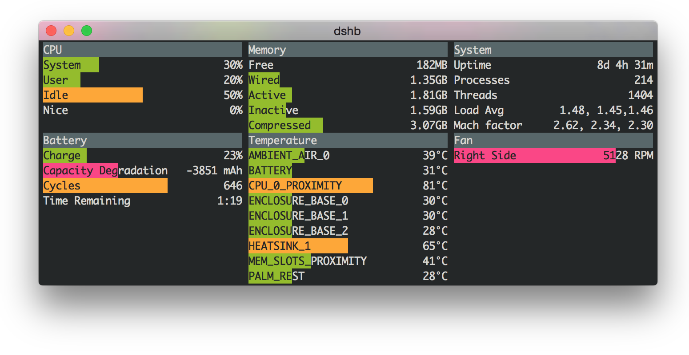

dshb
====

An OS X system monitor in Swift, inspired by
<a href="https://en.wikipedia.org/wiki/Top_(software)">top</a> &
[htop](https://github.com/hishamhm/htop). Displays live readings of system CPU &
memory usage, machine temperature sensors, fan speeds, battery information and
other miscellaneous system statistics. The ncurses based TUI (text-based user
interface) uses color coating to imply status and is fully resizable. Stats are
updated at one second intervals while still maintaining low overhead (the
<a href="https://en.wikipedia.org/wiki/Observer_effect_(physics)">observer effect</a>
is inescapable in this case sadly).




### Why?

- Exploration of Swift. In particular, systems programming and interfacing with
  low-level C APIs
- Improved top
- Improved htop (for OS X). htop was originally written for Linux. It was forked
  at some point and ported over to OS X. However, the port is now using what is
  a 5 year old fork. Work is being done to address
  [this](https://www.bountysource.com/teams/htop/fundraiser)

> Of course, the last two are far from being true! :) dshb is still early in
> development.


### Requirements

- [Xcode 7 Beta 1](https://developer.apple.com/xcode/downloads/)
- OS X 10.9+
    - This is due to Swift  


### Clone

Make sure to use the recursive option on clone to auto init all submodules.

```sh
git clone --recursive https://github.com/beltex/dshb
```

Incase you have already cloned the repository, run the following inside the
project directory.

```sh
git submodule update --init
```


### Install

This will build dshb from source and place the binary and manual page in your
path.

```sh
make install
```


### Stack

- [ncurses](https://www.gnu.org/software/ncurses/ncurses.html)
    - For drawing to the terminal (tested with version 5.4 - default on OS X)
- [SystemKit](https://github.com/beltex/SystemKit)
    - For almost all statistics
- [SMCKit](https://github.com/beltex/SMCKit)
    - For temperature & fan statistics
- [CommandLine](https://github.com/jatoben/CommandLine)
    - For the CLI
- [ronn](https://github.com/rtomayko/ronn)
    - For generating the manual page

All Git submodules are built part of the project as simply source files, not
frameworks (which are essentially dynamic libraries). This is because currently,
the Swift runtime dynamic libraries must be packaged with the application in
question. In the case of **dshb**, a single binary is generated which has the
runtime statically linked. Thus, frameworks, which expect to find the libraries
inside the application bundle (`.app`), cannot _"see"_ them.

For more see:

- [SwiftInFlux/Runtime Dynamic Libraries](https://github.com/ksm/SwiftInFlux#runtime-dynamic-libraries)
- [SwiftInFlux/Static Libraries](https://github.com/ksm/SwiftInFlux#static-libraries)


### References

- [top](http://www.opensource.apple.com/source/top/)
- [NCURSES Programming HOWTO](http://www.tldp.org/HOWTO/NCURSES-Programming-HOWTO/index.html)
- [Programmer's Guide to ncurses](http://www.c-for-dummies.com/ncurses/)
- [Writing Programs with NCURSES](http://invisible-island.net/ncurses/ncurses-intro.html)


### License

This project is under the **MIT License**.


##### _P.S._

Working on this always brought a smile to my face. I hope it brings a smile to
yours too.
[Enjoy](http://hypem.com/track/23j7h/First+Aid+Kit+-+My+Silver+Lining) :)
 
